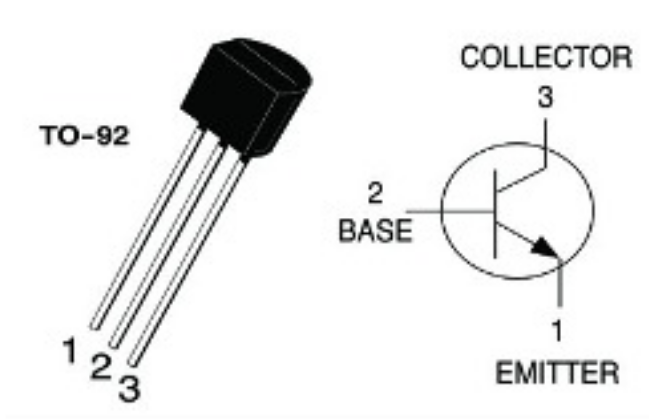
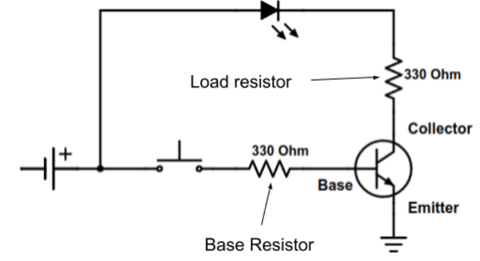

# Electronic Skills 4: Transistor Switch
In this assignment you will control an LED with a transistor switch.

## Transistors
A transistor is like a switch without any moving parts. A transistor is similar to a light switch. When you move the light switch handle, electrical current flows through the switch turning on the light. The difference between a mechanical light switch and a transistor, however, that in a transistor we are using a current to switch in on and off and transistors can switch much faster than mechanical switches. 

A transistor has three terminals (wires). One of the terminals (the base) is like the switch handle, it turns on the current in the two other wires. The three terminals in a transistor are called emitter, the collector and the base. when the base is connected to a positive voltage (which should always be through a resistor) the transistor turns on and current flows through it from the collector to the emitter.

Look carefully at the picture below to identify the emitter, base and collector on the transistor component.

Watch the following the videos:
* [The Invention that Changed the World](https://youtu.be/OwS9aTE2Go4)
* [The transistor](https://youtu.be/-td7YT-Pums)
* [A 1953 documentary about the transistor](https://youtu.be/V9xUQWo4vN0)
* [Moore’s Law](https://youtu.be/aWLBmapcJRU)

## Circuit 1
Breadboard the following circuit. Show the circuit to your teacher for marking.  

## Circuit 2
Modify your original circuit to have the transistor turning on two LEDs in parallel. Show the circuit to your teacher for marking. 
